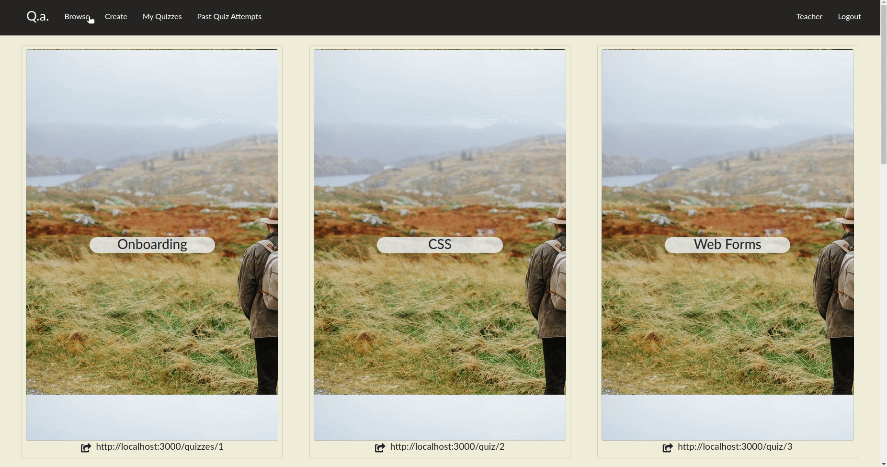
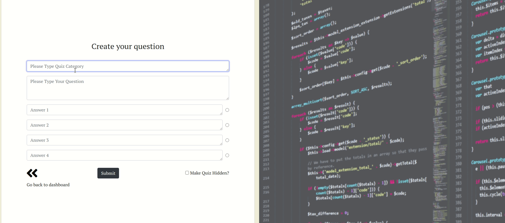
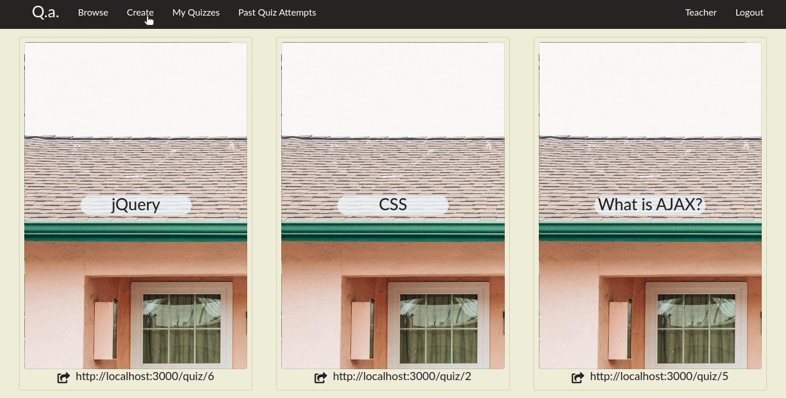

# Quiz App
Quiz app is a simple singe page app that you can use to create, take and share quizzes. You will be able to see your recent attempts at a quiz after completing them.

# User Stories

- As an educator/session facilitator/user I want to create quizzes to aid learning
- As a User I want the option to make my quizzes private
- As a user I want to share a link to a single quiz
- Users should have the ability to see a list of publicly available quizzes on the home page
- As a user I want the ability to participate in a quiz
- As a user I want to see the results of my recent attempt at a quiz
- As a user I should be able to share a link to the result of my attempt at the quiz

# Features

# Getting Started

1. Create the `.env` by using the below information in step 2 for reference
2. Update the .env file with your correct local information

- DB_USER="ELEPHANT SQL DB NAME"
- DB_HOST=lallah.db.elephantsql.com
- DB_PASS="ELEPHANT SQL DB PASS"
- DB_PORT=5432
- DB_NAME="ELEPHANT SQL DB NAME"
- Uncomment and set to true for Heroku
- DB_SSL=true if heroku
- DB_PORT=5432
- PORT=3000

- SECRET_KEY_1="ENTER A SECRET KEY"
- SECRET_KEY_2="ENTER A SECOND SECRET KEY"

3. Install dependencies: `npm i`
4. Fix to binaries for sass: `npm rebuild node-sass`
5. Reset database: `npm run db:reset`

- Check the db folder to see what gets created and seeded in the SDB

7. Run the server: `npm run local`

- Note: nodemon is used, so you should not have to restart your server

8. Visit `http://localhost:3000/`

# Warnings & Tips

- Do not edit the `layout.css` file directly, it is auto-generated by `layout.scss`
- Split routes into their own resource-based file names, as demonstrated with `users.js` and `widgets.js`
- Split database schema (table definitions) and seeds (inserts) into separate files, one per table. See `db` folder for pre-populated examples.
- Use the `npm run db:reset` command each time there is a change to the database schema or seeds.
  - It runs through each of the files, in order, and executes them against the database.
  - Note: you will lose all newly created (test) data each time this is run, since the schema files will tend to `DROP` the tables and recreate them.

# Dependencies

- Node 10.x or above
- NPM 5.x or above
- body-parser": ^1.19.0
- chalk: ^2.4.2
- cookie-session: ^1.4.0
- dotenv: ^2.0.0
- ejs": ^2.6.2
- express": ^4.17.1
- fs: 0.0.1-security
- morgan: ^1.9.1
- node-sass-middleware": ^0.11.0"
- pg: ^6.4.2
- pg-native": ^3.0.0

Dev Dependencies:

- chai: ^4.2.0
- chokidar: ^3.4.2
- mocha: 8.1.3
- nodemon: ^1.19.1

# Known Major Issues

- quizzes are not scoring and updating correctly yet on both teacher end and for student the server will hang https://github.com/andreiskandar/quiz-app/issues/64

- quizzes are limited currently to 1 question per quiz due to the way the DB is set up. The quiz_id auto increments as it is a serial primary key auto incrementing on each post request to the server on quiz creation. https://github.com/andreiskandar/quiz-app/issues/66

- the share quiz link needs updating to be correct currently e.g http://localhost:3000/quiz/1 will go to our forbidden page. The link needs to be:
http://localhost:3000/quiz/12/questions/15 (our questions are tied to the question_id in our database)

- there is currently no option to give the user feedback on their answer, did they get the Q right or wrong and why? https://github.com/andreiskandar/quiz-app/issues/63

- When a user starts a quiz there is no way to cleanly navigate away from the quiz: https://github.com/andreiskandar/quiz-app/issues/68

- When the user fiishes a quiz only the navbar-brand works: https://github.com/andreiskandar/quiz-app/issues/67

# Documentation

Our ERD and planning docs are contained in /docs-planning

# Features to add
Check out an extensive list of our upcoming features to add in our todo's and stretch columns at:

https://github.com/andreiskandar/quiz-app/projects/2

# Contributors
https://github.com/andreiskandar

https://github.com/hatheadninja

https://github.com/andrewrlloyd88

#

### Interested in becoming a contributor?

Contact andrew.lloyd01@googlemail.com
